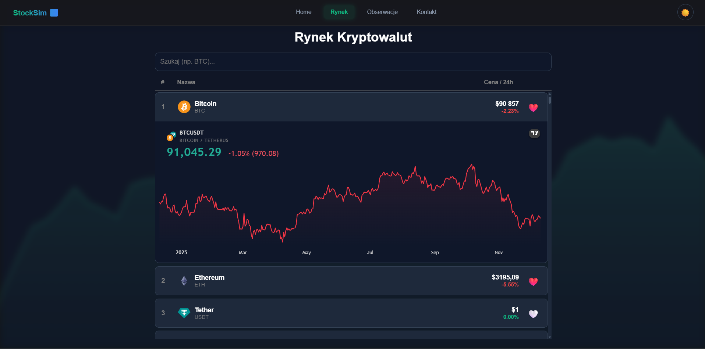

# 📈 StockSim – Symulator Giełdy Kryptowalut

Aplikacja do śledzenia cen kryptowalut w czasie rzeczywistym z wykresami technicznymi.

### Live Demo https://stock-sim-alpha.vercel.app/

## 📸 Wygląd aplikacji




## ✨ Co może robić?

✅ Przeglądaj TOP 50 kryptowalut z aktualnymi cenami  
✅ Dodawaj/usuwaj waluty do ulubionych  
✅ Oglądaj wykresy techniczne z TradingView  
✅ ciemny/jasny motyw  
✅ Formularz kontaktowy z walidacją  
✅ Pełna responsywność (mobile, tablet, desktop)  
✅ Animowane tło      
✅ Wyszukuj waluty po nazwie lub skrócie (np. "Bitcoin", "BTC")


## ⚙️ Instalacja i Uruchomienie

Aby uruchomić projekt na swoim komputerze wykonaj te 3 kroki w terminalu:

**1. Pobierz pliki projektu**
```bash
git clone https://github.com/Ack224/stock-sim.git
cd stock-sim
```

**2. Zainstaluj biblioteki**
```bash
npm install
```

**3. Uruchom aplikację**
```bash
npm run dev
```


## 🛠️ Użyte technologie

| Technologia | Do czego |
|-------------|---------|
| React 18 | Interfejs |
| React Router | Nawigacja |
| Context API | Motyw + Ulubione |
| Axios | API |
| TradingView | Wykresy |
| localStorage | Pamiętanie wyborów |


## 📁 Struktura

```
src/
├── components/      # Komponenty (Navigation, Layout, Tło)
├── context/         # Zarządzanie stanem (Motyw, Ulubione)
├── pages/           # Strony (Home, Market, Obserwacje, Kontakt, 404)
└── App.jsx
```


## 🎯 Jak to działa?

### Context API
- **ThemeContext** – pamięta wybrany motyw (jasny/ciemny)
- **FavoritesContext** – pamięta które waluty dodałeś do ulubionych

### React Router
5 stron: Home → Market → Obserwacje → Kontakt → NotFound

### API
Dane z publicznego API CoinGecko 

### Wyszukiwarka
Działa w czasie rzeczywistym po stronie przeglądarki (Client-Side Filtering). Filtruje pobraną listę 50 walut, sprawdzając, czy wpisana fraza pasuje do pełnej nazwy lub symbolu waluty.

### Tło (animacja SVG)
Na tle generowana jest losowa linia wykresu. Zaczyna się z lewej, płynnie porusza się w prawo, powtarza się w kółko.

### Widgety TradingView
To małe wykresy z aplikacji TradingView. Ładują się dynamicznie gdy klikniesz na walutę – pobierają dane finansowe z internetu i wyświetlają je na żywo.


## 📱 Responsywność

**Na małym ekranie (telefon):**
- Nawigacja ukrywa się w hamburger menu
- Elementy ułożone w jedną kolumnę

**Na średnim ekranie (tablet):**
- Elementy obok siebie w miarę miejsca

**Na dużym ekranie (komputer):**
- Pełna nawigacja widoczna zawsze


## 🐛 Znane problemy

1. Brak komunikatu gdy API jest niedostępne (pokazuje "Ładowanie...")
2. TradingView wymaga internetu
3. Hamburger nie zamyka się automatycznie


## 💡 Co było najtrudniejsze?
 
**TradingView Widgety** – Wykresy nie wyświetlały się z pierwszą próby, trzeba było wyczyścić kontener przed załadowaniem nowego  
**Pamiętanie wyborów** – Gdy odświeżysz stronę, ulubione powinny zostać. Rozwiązanie: zapisywanie w pamięci przeglądarki


## 🔮 Plany na przyszłość

- Symulator/Gra
- Dodanie wykresów akcji
- Login

# Podziękowania
> Cały styl dokumentacji został pożyczony od [@Teczak-dev](https://github.com/Teczak-dev) a podziękowania zostały pożyczone od [@NokielCB](https://github.com/NokielCB).

## 📞 Kontakt

GitHub: [@Ack224](https://github.com/Ack224/stock-sim)


